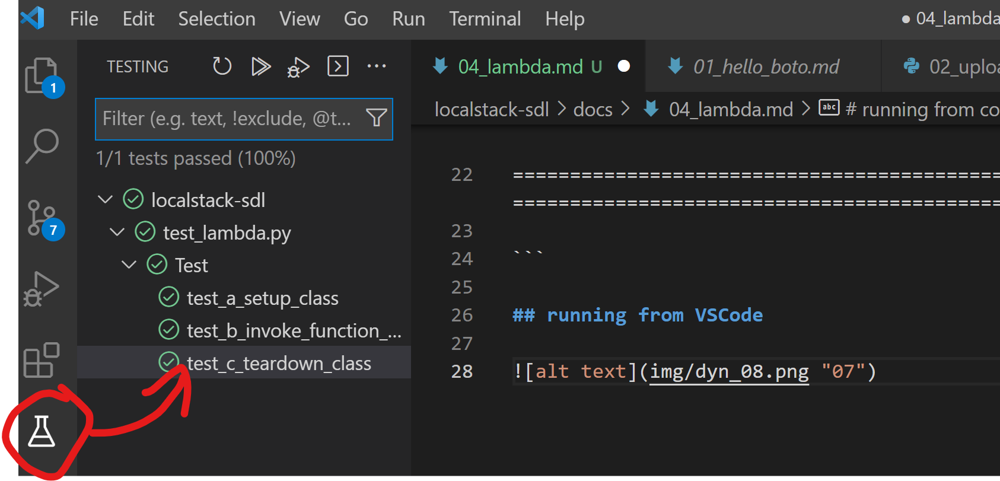

# lambda

copied straight from the tutorial

```
pip install pytest
```

# running from command line

```
PS D:\pub\localstack-sdl> pytest -s .                                                                                                                                                                    
========================================================================================= test session starts ========================================================================================== 
platform win32 -- Python 3.8.1, pytest-7.1.2, pluggy-1.0.0                                                                                                                                               
rootdir: D:\pub\localstack-sdl                                                                                                                                                                           
collected 3 items                                                                                                                                                                                        
                                                                                                                                                                                                         
test_lambda.py                                                                                                                                                                                           
Creating the lambda function...                                                                                                                                                                          
.                                                                                                                                                                                                        
Invoking the lambda function...                                                                                                                                                                          
.                                                                                                                                                                                                        
Deleting the lambda function...                                                                                                                                                                          
.                                                                                                                                                                                                        
                                                                                                                                                                                                         
========================================================================================== 3 passed in 2.55s =========================================================================================== 

```

## running from VSCode

